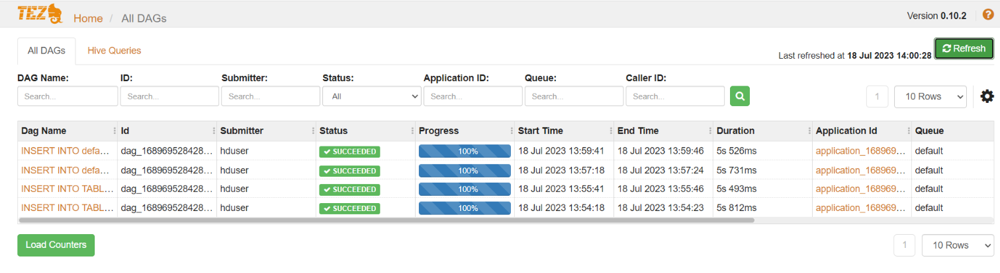
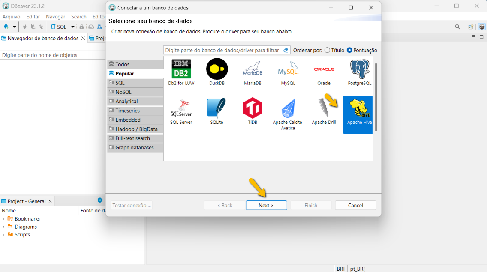

## Docker - Adicionando Data Warehouse Hive 3.1.3 no cluster Hadoop 3.3.5

**Apache Hive** é o **Data Warehouse** que pode ser integrado no **Data Lake Hadoop** sobre o **HDFS**, ou seja, um **Data Warehouse** rodando sobre uma infraestrutura de **Big Data**. 

Com ele você vai consegue interagir e manipular dados **estruturado** e **semi-estruturados** usando linguagem **SQL** no seu **Data Lake**. 

Inclusive o **Hive** é bem seguro quando se habilita as funcionalidades de autenticação e autorização quando necessário.

Isso torna sua interação com o **Data Lake** muito mais fácil, amigável e intuitiva através do bom e velho conhecido **SQL**.

No passo a passo a seguir, além de ser realizada a integração do **Hive** com o **Data Lake Hadoop**, será feita também a integração do **Hive** com o **Apache Tez** para que o **Hive** possa usar o **Tez** como motor de operações.

**Apache Tez** foi feito para rodar sobre o **Yarn** e usando ele como motor as operações sobre o Hive podem ficar até 100x mais rápidas, ou seja, é uma baita de uma turbinada!

Para o exemplo não usarei autenticação, mas o **Hive** suporte autenticações do tipo: **Nenhuma** (a que usaremos), **Kerberos**, **LDAP**, **Custom** (você cria a sua em Java) e **PAM**.

Na parte de autorização não utilizarei nenhuma, mas é possível definir níveis de permissões de uma forma bem semelhante aos bancos relacionais.

### Requisitos mínimos

Ter em seu SO host e ambiente os seguintes software e recursos.
Abaixo segue o link para download.

- Docker (Software para criação e administração de containers)

  https://docs.docker.com/get-docker/

  Se quiser montar um ambiente com docker completamente isolado do seu SO no tutorial abaixo mostro como fazer isso.

  https://github.com/tiagotsc/vagrant-docker

- Hadoop (Data Lake Hadoop em execução)

  No link abaixo mostro o passo a passo de como criar um.

  https://github.com/tiagotsc/docker-hadoop

- Dbeaver (IDE para acessar diversos bancos)

  https://dbeaver.io/download/
  

### Siga as etapas

1 - Crie uma pasta com nome de sua preferência em qualquer lugar do seu SO. No meu caso vou chama lá de “**hive**”.

````bash
# Cria a pasta
mkdir hive
# Entra na pasta
cd hive
````

2 - Dentro da pasta **hive**, crie as pastas **binarios** e **config-files**, conforme exemplo da figura abaixo:


3 - Faça o download do **Apache Hadoop 3.3.5**,  **Java JDK 1.8** e o **Tez 0.10.2**, e descompacte em qualquer lugar.

Segue link dos binários, lembrando que os links podem mudar com o tempo:

- Hadoop 3.3.5

  https://dlcdn.apache.org/hadoop/common/hadoop-3.3.5/hadoop-3.3.5.tar.gz

- Java JDK 1.8 (Exemplo: Linux x64 jdk-8u202-linux-x64.tar.gz)

  https://www.oracle.com/br/java/technologies/javase/javase8-archive-downloads.html

- Hive 3.1.3

  https://dlcdn.apache.org/hive/hive-3.1.3/apache-hive-3.1.3-bin.tar.gz

- Tez 0.10.2

  https://dlcdn.apache.org/tez/0.10.2/apache-tez-0.10.2-bin.tar.gz

```bash
# Descompacta os arquivos
tar -xvf hadoop-3.3.5.tar.gz
tar -xvf jdk-8u202-linux-x64.tar.gz
tar -xvf apache-hive-3.1.3-bin.tar.gz
tar -xvf apache-tez-0.10.2-bin.tar.gz
```

Observação: No meu caso como estou usando o **Vagrant** e a pasta **projeto** é compartilhada entre Windows e Linux, fiz a descompactação em outra pasta dentro da VM, por causa do conflito no link simbólico.

4 - Renomeie a pasta **hadoop-3.3.5** para **hadoop**, **jdkx.x.x.x** para **jdk**, **apache-hive-3.1.3** para **hive** e **apache-tez-0.10.2-bin** para **tez**, e faça a cópia para a pasta **binarios**.

```bash
# Renomeando pastas dos arquivos descompactados
mv hadoop-3.3.5 hadoop
mv jdk1.8.0_202/ jdk
mv apache-tez-0.10.2-bin tez
# Fazendo a cópia para a pasta binarios
cp -R hadoop ~/hive/binarios/
cp -R jdk ~/hive/binarios/
cp -R tez ~/hive/binarios/
```

Como ficará o diretório **binarios** da pasta **hive**, por exemplo:


### Os passos abaixo devem ser executados apenas na pasta hive criada anteriormente

1 - Entre na pasta **hive** e crie o arquivo **Dockerfile**, sem extensão.

```bash
# Entrar na pasta hive
cd ~/hive/
# Cria o arquivo Dockerfile
touch Dockerfile
```

Esse arquivo conterá todos os recursos e configurações necessárias que nossa imagem Hive precisará.

2 - Adicione o seguinte conteúdo no arquivo **Dockerfile** e salve.

https://github.com/tiagotsc/docker-hadoop/blob/19c425b95d4f350ed8e61f1cadd64ee1934f2b35/hadoop_3.3.5/namenode/Dockerfile#L1-L146

3 - Na pasta onde tem o **Dockerfile**, crie o arquivo **script.sh** e adicione o conteúdo:

https://github.com/tiagotsc/docker-hadoop/blob/19c425b95d4f350ed8e61f1cadd64ee1934f2b35/hadoop_3.3.5/namenode/script.sh#L1-L5

Esse arquivo fará o ajuste de privilégios na nossa imagem.

4 - Na pasta **config-files**, que foi criada anteriormente, adicione os arquivos que estão presentes na pasta **hive/config-files** desse repositório.

Esses arquivos possuem as configurações necessárias para que o **Hive** se integrado com o nosso **Data Lake Hadoop** e também para que possa fazer uso do Tez como motor de buscas.

5 - Agora já podemos construir a imagem, estando na pasta **hive** que contém o arquivo **Dockerfile**, execute:

```bash
# Constrói a imagem
docker build . -t hive:3.1.3
```

6 - Imagem criada, já é possível subir o container executando um dos dois passos abaixo.

Importante: O container precisa estar na mesma rede do DataLake para que eles possam se comunicar.

````bash
# No meu caso a rede é: hadoop_dl_net
# Comando usado para criar rede: 
docker network create -d bridge hadoop_dl_net
````

- 1ª opção: Suba o container atribuindo um volume para o MySQL para não perder seus dados.

  A imagem criada já possuí uma instalação do MySQL para servir de Metastore.

  ```bash
  # Crie uma pasta para alocar os dados do banco e monte no container
  mkdir ~/db 

  # Suba o container referenciando a pasta
  docker run -dit --net hadoop_dl_net --hostname hive --name hive -v /home/vagrant/db:/var/lib/mysql -p 10002:10002 -p 10000:10000 -p 8080:8080 -p 9999:9999 -p 8188:8188 --privileged hive:3.1.3 /usr/sbin/init
  ```

- 2ª opção: Suba o container direto sem volume

  ````bash
  # Suba o container sem pasta
  docker run -dit --net hadoop_dl_net --hostname hive --name hive -p 10002:10002 -p 10000:10000 -p 8080:8080 -p 9999:9999 -p 8188:8188 --privileged hive:3.1.3 /usr/sbin/init
  ````

7 - Entre no container hive e execute os passos.

````bash
# Entre no container usando o usuário hduser
docker exec -u hduser -it hive /bin/bash

# veja se o MySql está rodando
sudo systemctl status mysqld
# Se não estiver rodando, inicie
sudo systemctl start mysqld

# Pegue a senha root temporário do MySql e guarde bem, pois será usado no próximo passo
sudo grep 'temporary password' /var/log/mysqld.log
````

8 - Ainda dentro do container hive vamos configurar a instalação segura do MySql

````bash
# Para entra no modo de configuração do modo seguro do MySql, execute
sudo mysql_secure_installation

# 1 - Será solicitado a senha. Informe a senha temporária recuperada anteriormente.

# 2 - Crie uma nova senha e confirme ela. Guarde bem essa nova senha.

# 3 - Será perguntado se deseja alterar senha atual, informe N, pois a nova senha acabou de ser redefinida.

# 4 - Próxima pergunta se deseja remover usuário anônimo, informe Y (sim)

# 5 - Próxima pergunta se deseja remover acesso remoto com o root, informe Y (sim)

# 6 - Próxima pergunta se deseja remover banco de teste, informe Y (sim)

# 7 - Próxima pergunta se deseja atualizar privilégios do banco, informe Y (sim)

# Opcional, diretório banco, caso queira montar um volume
# /var/lib/mysql
````

Abaixo segue um print dos passos executados anteriormente.


9 - Vamos agora acesar o MySql, criar o banco **metastore** para uso do **Hive** e vamos criar usuário de acesso para ele.

````bash
# Acesso o Mysql com usuário root e senha definida anteriormente.
mysql -u root -p

# Dentro do Mysql, crie o banco Metastore
CREATE DATABASE metastore;

# Dentro do Mysql, crie o usuário 
CREATE USER 'hiveuser'@'localhost'IDENTIFIED WITH mysql_native_password BY 'Hiveuser@123';

# Dentro do Mysql, defina os privilégios do novo usuário
GRANT ALL PRIVILEGES ON metastore.* TO 'hiveuser'@'localhost';

# Recarregue os privilégios do banco
FLUSH PRIVILEGES;

# Saia do MySql
exit;
````

10 - Vamos popular nosso banco **Metastore** e isso pode ser feito de 2 formas. Escolha uma das duas abaixo:

- 1ª: Dentro do Mysql

  ````bash
  # Acesse MySql
  mysql -u root -p

  # Entre no banco Metastore
  USE metastore;

  # Carregue no banco o script
  SOURCE /home/hduser/hive/scripts/metastore/upgrade/mysql/hive-schema-3.1.0.mysql.sql;

  # Veja se tabelas foram criadas
  SHOW TABLES;

  # Sai do MySql
  exit;
  ````

- 2ª: Fora do MySql, via **schematool**

  ````bash
  # Popule o banco Metastore executando o comando
  $HIVE_HOME/bin/schematool -initSchema -dbType mysql
  ````

  No final do processo deverá aparecer essa informação.

  

  Para ter certeza que está tudo ok, vamos ver se o banco no MySql foi populado.

  ````bash
  # Acesse MySql
  mysql -u root -p

  # Entre no banco Metastore
  USE metastore;

  # Veja se tabelas foram criadas
  SHOW TABLES;

  # Sai do MySql
  exit;
  ````

11 - Adicione o **Tez** no **HDFS**.

````bash
# Data Lake ligado, crie a pasta no HDFS
hdfs dfs -mkdir -p /apps/tez

# Envie o arquivo do Tez para a pasta criada no HDFS
hdfs dfs -put $TEZ_HOME/share/tez.tar.gz /apps/tez
````

12 - Inicie o **Apache Tomcat** para ter acesso ao **Tez UI**

````bash
# Inicie o TOMCAT
sudo systemctl start tomcat
# Veja o status do TOMCAT
sudo systemctl status tomcat
# Opcional, se quiser acessar a parte adm do Apache TOMCAT, acesse no navegador
http://IP_SUA_VM:8080/
# Na adm do Apache TOMCAT, logue os dados (dados do arquivo tomcat-users.xml): 
# Usuário: admin
# Senha: password
````

13 - Suba os serviços para que o **Hive** possa ser acessado

````bash
mapred --daemon start historyserver
yarn --daemon start timelineserver
nohup hive --service metastore > metastore.log &
# Inicia Hive server
nohup hive --service hiveserver2 > hive.log &
# Hive server, se quiser iniciar com debug habilitado, execute
hive --service hiveserver2 --hiveconf hive.root.logger=DEBUG,console
````
- Se o seu **Docker** estiver rodando direito no seu SO host, acesse:
  
  HiveServer2: 
  http://localhost:10002

  Tez UI:
  http://localhost:8080/tez-ui

- Se seu Docker estiver rodando de forma isolada em alguma VM, lembrando que é necessário liberar a porta no firewall, acesse:

  HiveServer2:
  http://IP_SUA_VM:10002

  Tez UI:
  http://IP_SUA_VM:8080/tez-ui

E você verá as seguintes telas:

Para HiveServer2


Para Tez UI


#### Enviando a imagem Hive para o DockerHub

````bash
# Logue no Docker
docker login

# Depois que tiver construído localmente sua imagem, crie a tag apontando para a imagem criada
docker image tag hive:3.1.3 SEU_USUARIO_DOCKER/hive:3.1.3

# Envie a imagem
docker image push SEU_USUARIO_DOCKER/hive:3.1.3
````

### Acessando internamente o Hive de dentro do container

Esse acesso pode ser feito de 2 forma:

- 1ª forma: Hive CLI
  ````bash
  # Para acessar o Hive, execute
  hive

  # Opcional, dentro do hive se quiser mudar configurações da sessão, por exemplo, execute
  set mapreduce.framework.name=yarn;
  set hive.tez.cpu.vcores=1;

  # Opcional, se quiser entrar no Hive mudando antes algumas configurações, por exemplo, execute
  hive -hiveconf hive.tez.container.size=512 -hiveconf hive.tez.java.opts="-server -Xmx512m -Djava.net.preferIPv4Stack=true"

  # Opcional, se quiser mudar a engine para mapreduce, execute
  set hive.execution.engine=mr;

  # Opcional, se quiser mudar a engine para tez, execute
  set hive.execution.engine=tez;

  # Opcional, se quiser iniciar o hive CLI em debug, execute
  hive --hiveconf hive.root.logger=DEBUG,console

  # Exemplo de como executar uma consulta sem precisar entrar no Hive
  hive -hiveconf hive.tez.container.size=512 -hiveconf hive.tez.java.opts="-server -Xmx512m -Djava.net.preferIPv4Stack=true" -e "select * from student;"
  ````

- 2ª forma: Beeline CLI
  ````bash
  # Entrar no Beeline
  beeline -u 'jdbc:hive2://192.168.56.200:10000'

  # sair beeline
  !q ou !quit

  # Se quiser executar uma consulta, só um exemplo, sem entrar no beeline, execute
  beeline -u 'jdbc:hive2://192.168.56.200:10000' -e "select * from student;"
  
  # ou pode acessar da seguinte forma também
  beeline
  !connect jdbc:hive2://192.168.56.200:10000
  # Em seguida aperte ENTER 2x

  # Se estiver com autenticação LDAP configurada, por exemplo, pode ser acessado da seguinte forma
  beeline -u 'jdbc:hive2://192.168.56.200:10000/default' -n usuario -p senha
  OU
  beeline
  !connect jdbc:hive2://192.168.56.200:10000/default;user=usuario;password=senha

  # Exemplo de como rodar uma consulta, com autenticação se disponível, sem entrar no Beeline
  beeline -u 'jdbc:hive2://192.168.56.200:10000/default' -n admin -p senha -e "select * from student;"
  ````

### Acessando o Hive externamente através do DBeaver

Depois de ter instalado no DBeaver no seu SO. Abra-o.

Na tela principal, selecione o **Apache Hive** e clique em **Next**.



Na próxima tela, no campo **Host** informe o **IP** da sua **VM** onde está rodando o **Hive** e clique em **Testar conexão**.
No meu caso, minha **VM** é **192.168.56.200**.


Se tudo ocorrer bem, abrirá a seguinte janela e é só clicar em **OK** e depois em **Finish**.


Se a conexão foi realizada com sucesso, você verá a seguinte tela com o banco **default** do **Hive**.


Show! Agora é só interagir com seu Data Lake manipulando dados **estruturados** e **semi-estruturados** através do mega popular **SQL**.

#### Concluiu todo o passo a passo e desejava remover os recursos criados, execute os comandos abaixo:

````bash
docker container rm -f hive
docker image rm hive:3.1.3
docker image rm SEU_USUARIO_DOCKER/hive:3.1.3
docker network rm hadoop_dl_net
````

### Alguns comandos úteis

```bash
##### VAGRANT - é preciso estar na pasta que contém o Vagrantfile #####

# Liga VM, ou cria, caso ainda não exista
vagrant up

# Desliga a VM
vagrant halt

# Reiniciar a VM
vagrant reload

# Destrói a VM, mas pergunta antes
vagrant destroy

# Destrói a VM sem perguntar
vagrant destroy -f

##### DOCKER #####

# Listar redes
docker network ls

# Listar containers parados e em execução
docker container ls -a

# Listar imagens
docker image ls

# Se quiser parar o container criado
docker container stop hive

# Se quiser iniciar o container que já tinham sido criado em algum momento, caso esteja parado
docker container start hive

# Se quiser remover os container
docker container rm -f hive

# Se quiser remover as imagens criada
docker image rm hive:3.1.3

# Criar container a partir da imagem remota, caso tenha enviado para o DockerHub
docker run -dit --net hadoop_dl_net --hostname hive --name hive -p 10002:10002 -p 10000:10000 -p 8080:8080 -p 9999:9999 -p 8188:8188 --privileged SEU_USUARIO_DOCKER/hive:3.1.3 /usr/sbin/init

# Puxar só a imagem remota, caso tenha enviado para o DockerHub
docker pull SEU_USUARIO_DOCKER/hive:3.1.3

# Remove localmente imagem obtida do DockerHub
docker image rm SEU_USUARIO_DOCKER/hive:3.1.3

# Ficou sem espaço no seu ambiente Docker
# Cuidado! esse comando apaga vários recursos criados pelo Docker, só é recomendado em ambientes puramente de testes
docker system prune --all --force
```

Todo o tutorial aplicado aqui, já se encontra pronto para uso nesse repositório, se você tiver em seu SO o **Vagrant** e **VirtualBox**, basta clonar, subir o ambiente, baixar os binários e seguir os passos de construção das imagens e consequentemente containers.

O passo a passo foi desenvolvido encima do **Vagrant 2.3.3** e **VirtualBox 7.0.6**.

#### Documentação oficial do Vagrant

https://developer.hashicorp.com/vagrant/docs

#### Documentação oficial Docker
https://docs.docker.com/

#### Documentação oficial Hadoop 3.3.5
https://hadoop.apache.org/docs/r3.3.5/

#### Documentação oficial Hive 3.3.1
https://hive.apache.org/

https://cwiki.apache.org/confluence/display/Hive/

https://www.devdoc.net/bigdata/hive-confluence-20210220/display/Hive/Home.html

#### Documentação oficial Yarn Timeline Server
https://hadoop.apache.org/docs/current/hadoop-yarn/hadoop-yarn-site/TimelineServer.html

#### Documentação Apache Tez
https://tez.apache.org/

#### Documentação oficial Apache Yarn
https://hadoop.apache.org/docs/current/hadoop-yarn/hadoop-yarn-site/YARN.html

#### Tutorial sobre Apache TOMCAT
https://www.digitalocean.com/community/tutorials/how-to-install-apache-tomcat-7-on-centos-7-via-yum

## 🔗 Links
[](https://www.linkedin.com/in/tiago-s-costa)
